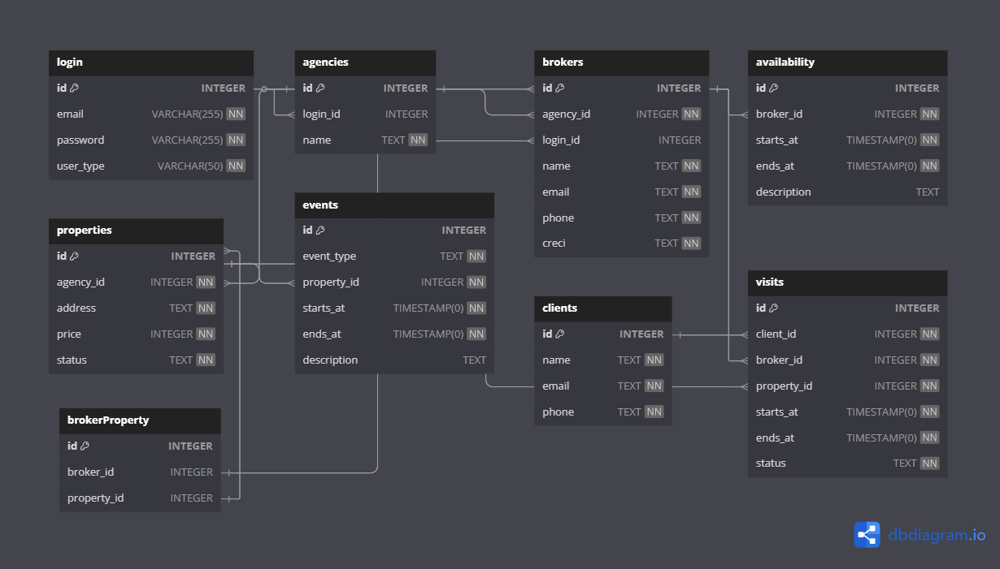
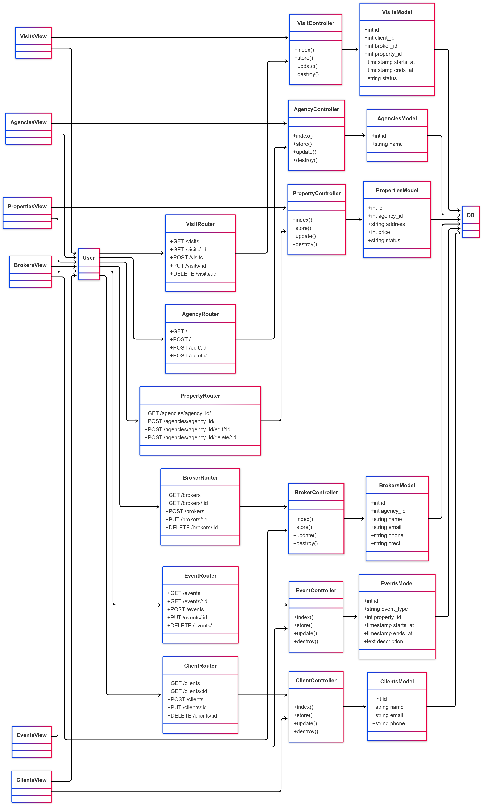
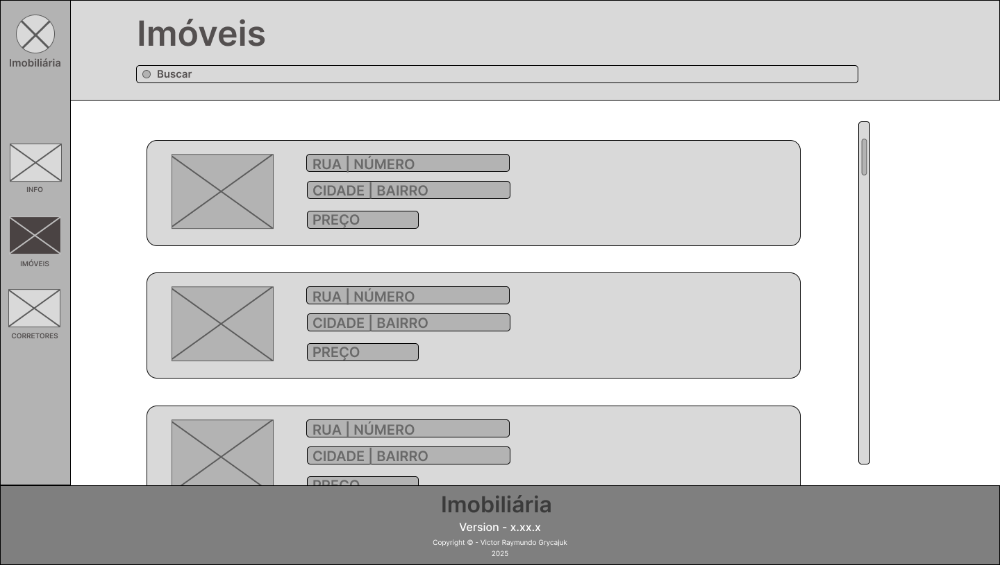
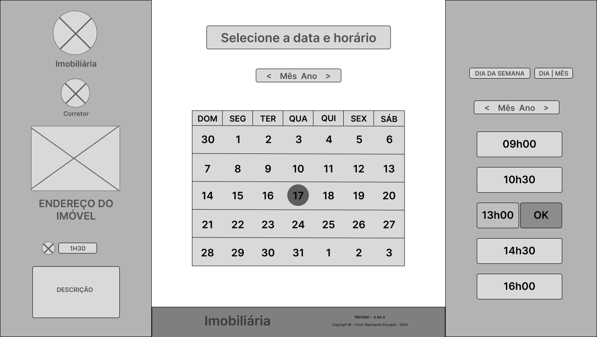
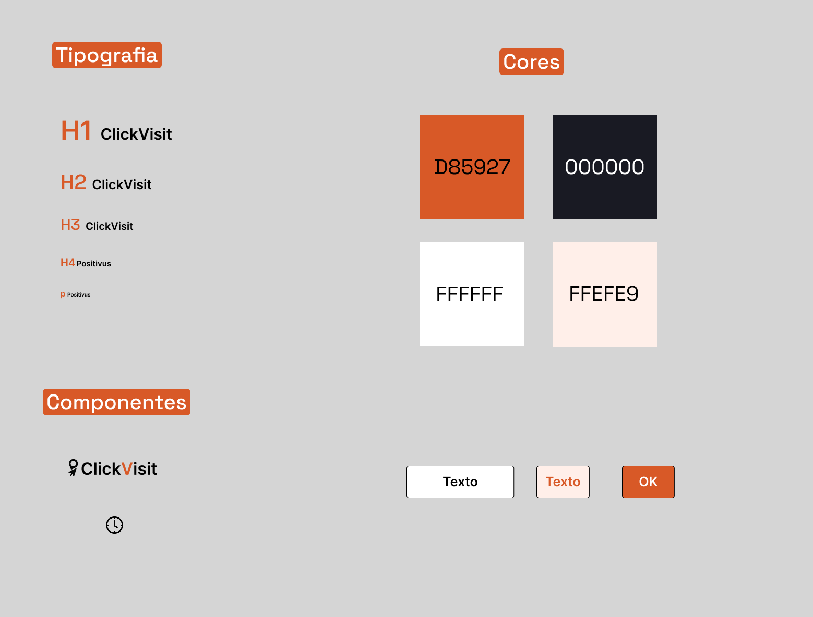
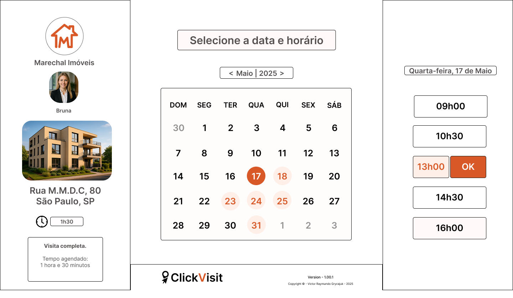
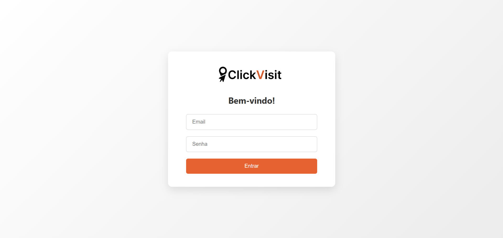
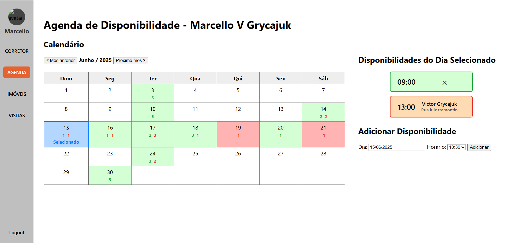
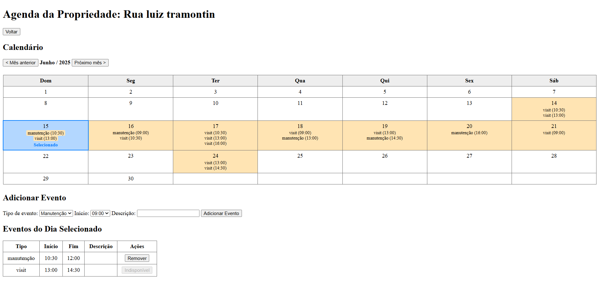
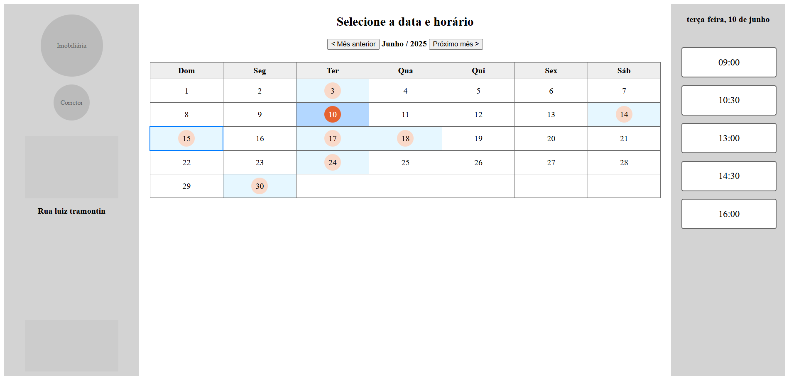

# Web Application Document

 

#### por Victor Grycajuk
----

## Sumário

1. [Introdução](#c1)  
2. [Visão Geral da Aplicação Web](#c2)  
3. [Projeto Técnico da Aplicação Web](#c3)  
4. [Desenvolvimento da Aplicação Web](#c4)  
5. [Referências](#c5)  

 

## 1. Introdução (Semana 01)

### Descrição do Projeto

A ClickVisit é uma aplicação web para o agendamento de visitas a imóveis, destinada a corretores autônomos e, principalmente, a imobiliárias.

O sistema permite que os clientes visualizem a disponibilidade combinada entre duas agendas: a do corretor e a do imóvel. Com essas informações, o cliente consegue agendar, de forma simples e rápida, o melhor horário disponível para a sua própria agenda.

### Tipos de Login

- **Imobiliária (ou corretor autônomo):**  
  Responsável pelo cadastro de imóveis e pela gestão de suas respectivas agendas. Pode inserir bloqueios nos horários (como reformas, vistorias, entre outros) e definir quais corretores estão vinculados a cada imóvel.

- **Corretor de imobiliária:**  
  Gerencia sua agenda pessoal e os links exclusivos enviados a clientes interessados em determinados imóveis.

### Processo de Agendamento

O agendamento é totalmente feito pelo cliente, através de um link individual gerado pelo corretor.  
Ao acessá-lo, o cliente visualiza as agendas do imóvel e do corretor e escolhe o horário mais conveniente.

Uma vez confirmada, a reserva é automaticamente registrada tanto na agenda do imóvel quanto na do corretor, bloqueando aquele horário para futuras marcações.

### Objetivo

Proporcionar uma experiência de agendamento prática, visual e organizada para todas as partes envolvidas.

---

## 2. Visão Geral da Aplicação Web

### 2.1. Personas (Semana 01)

Figura 1 - Persona  

Fonte: Victor Grycajuk, 2025.

### 2.2. User Stories (Semana 01)

#### US01: Como gerente da imobiliária, quero visualizar e controlar as agendas de todos os imóveis e corretores, para garantir que as visitas sejam organizadas sem conflitos de horários.

I - O gerente pode visualizar e controlar agendas sem depender de outras funcionalidades, como envio de links ou cadastro de novos clientes.

N - O nível de detalhe do controle (ex: apenas visualizar vs. editar horários) pode ser ajustado conforme a necessidade do projeto. 

V - Esse sistema traz valor direto para a organização e eficiência da imobiliária. Organiza agendas aumentando a produtividade dos corretores.

E - É possível estimar o esforço de desenvolvimento com base em requisitos simples (visualizar, bloquear horários, editar agendas).

S - É uma história que pode ser dividida e implementada de forma objetiva (não é como um épico). Engloba apenas alguns agendamentos e não todo o fluxo dos clientes (peospecção, mostragem de imóvel...).

T - É fácil criar testes para verificar se o gerente consegue visualizar todas as agendas e identificar conflitos de horários. Pode-se testar se o gerente consegue visualizar todas as agendas ou se, por exemplo, visitas em horários conflitantes não são possíveis de serem marcadas.

#### US02: Como corretor de imóveis, quero cadastrar minha agenda de disponibilidade, para facilitar o agendamento de visitas pelos clientes sem precisar gerenciar manualmente.

#### US03: Como cliente interessado em um imóvel, quero acessar um link e agendar uma visita em poucos cliques, para escolher o melhor horário disponível sem depender de intermediários.

---

## 3. Projeto da Aplicação Web

### 3.1. Modelagem do banco de dados  (Semana 3)

#### Diagrama de modelos relacionais

Figura 2 - Diagrama do banco de dados  

Fonte: Victor Grycajuk, 2025.

#### SQL completo

Disponível em [`ClickVisit.sql`](../scripts/ClickVisit.sql), ou

### 3.1.1 BD e Models (Semana 5)
#### Os models implementados até o momento, 24/05/2025 são:
#### agency.js - disponível em [`models/agency.js`](../models/agency.js)

    Realiza as manipulações no banco de dados referentes as agencias imobiliárias.
        create() - 'INSERT INTO agencies (name) VALUES ($1)'
        findAll() - 'SELECT * FROM agencies ORDER BY name ASC'
        update() - 'UPDATE agencies SET name = $1 WHERE id = $2'
        delete() - 'DELETE FROM agencies WHERE id = $1'

#### property.js - disponível em [`models/property.js`](../models/property.js)
    
    Realiza as manipulações no banco de dados referentes as propriedades de uma agencia imobiliaria especifica.
        create() - 'INSERT INTO properties (agency_id, address, price, status) VALUES ($1,$2,$3,$4)'
        findAll() - 'SELECT * FROM properties WHERE agency_id=$1 ORDER BY id'
        update() - 'UPDATE properties SET address=$1, price=$2, status=$3 WHERE id=$4'
        delete() - 'DELETE FROM properties WHERE id=$1'
### 3.2. Arquitetura (Semana 5)

#### O seguinte diagrama representa a arquitetura MVC do ClickVisit

Figura 3 - Diagrama de arquitetura MVC.  

Fonte: Victor Grycajuk usando Mermaid.io, 2025.

#### Até o momento, 24/05/2025, os conjuntos MVC implementados são: 
    AgencyView -> AgencyRoutes -> AgencyController -> AgencyModel
    PropertiesView -> PropertiesRoutes -> PropertiesController -> PropertiesModel 

#### Os conjuntos MVC restantes: Brokers, Clients, Events e Visits ainda estão sendo implementados.
### 3.3. Wireframes (Semana 03)

#### Consulta de imóveis para Imobiliária
Representa as funcionalidades descritas no User Story 01.
- US01: Como gerente da imobiliária, quero visualizar e controlar as agendas de todos os imóveis e corretores, para garantir que as visitas sejam organizadas sem conflitos de horários.

Figura 4 - Tela de consulta de imóveis para Imobiliária  

Fonte: Victor Grycajuk, 2025.

#### Seleção de horários para clientes.
Representa as funcionalidades descritas no User Story 03.
- US03: Como cliente interessado em um imóvel, quero acessar um link e agendar uma visita em poucos cliques, para escolher o melhor horário disponível sem depender de intermediários.

Figura 5 - Tela de seleção de horários para Cliente  

Fonte: Victor Grycajuk, 2025.

### 3.4. Guia de estilos (Semana 05)

Figura 6 - Guia de estilos  

Fonte: Victor Grycajuk, 2025.

### 3.5. Protótipo de alta fidelidade (Semana 05)

Figura 7 - Portótipo de Alta Fidelidade  

Fonte: Victor Grycajuk, 2025.

#### Este é o primeiro protótipo de alta fidelidade do ClickVisit. Esta tela representa a principal tela do usuáro, onde ele conseguirá agenda o horário ideal. Esta tela supre as necessidades do User Story 03.

### 3.6. WebAPI e endpoints (Semana 05)

### Agências

| Método | Caminho                | Descrição                             | Controller                 |
| ------ | ---------------------- | ------------------------------------- | -------------------------- |
| GET    | `/agencies/`           | Lista todas as agências               | `agencyController.index`   |
| POST   | `/agencies/`           | Cria uma nova agência                 | `agencyController.store`   |
| POST   | `/agencies/edit/:id`   | Atualiza a agência indicada por `:id` | `agencyController.update`  |
| POST   | `/agencies/delete/:id` | Remove a agência indicada por `:id`   | `agencyController.destroy` |

---

### Imóveis (aninhados em `/agencies/:agencyId/properties`)

| Método | Caminho       | Descrição                                 | Controller                   |
| ------ | ------------- | ----------------------------------------- | ---------------------------- |
| GET    | `/`           | Lista os imóveis da agência (`:agencyId`) | `propertyController.index`   |
| POST   | `/`           | Cria um imóvel para a agência             | `propertyController.store`   |
| POST   | `/edit/:id`   | Atualiza o imóvel `:id` dessa agência     | `propertyController.update`  |
| POST   | `/delete/:id` | Remove o imóvel `:id` dessa agência       | `propertyController.destroy` |

---

### 3.7 Interface e Navegação (Semana 07)

Grande parte das telas ainda estão grosseiras, toda a fucionalidade foi implementada mas ainda faltam alguns polimentos, como: 
- Troca das cores para o laranja D85927 e FFEFE9
- Organização dos elementos na tela como planejado no protótipo HI-Fi.
- Rodapé e sidebar
- Imagens e logos

Aqui estão algumas imagens das principais telas:

Figura 8 - Login  

Fonte: Victor Grycajuk, 2025.

Figura 9 - Agenda do corretor  

Fonte: Victor Grycajuk, 2025.

Figura 10 - Agenda da Propriedade  

Fonte: Victor Grycajuk, 2025.

Figura 11 - Agendamento  

Fonte: Victor Grycajuk, 2025.

---

## 4. Desenvolvimento da Aplicação Web (Semana 8)

### 4.1 Demonstração do Sistema Web (Semana 8)

Veja o funcionamento do sistema:
[Video demonstrativo](https://drive.google.com/file/d/1o0AENcoTsx6A9lpihsi9iEoB1boTJpUp/view?usp=sharing)

O sistem web do ClickVisit consiste em 2 tipos de logins principais, Imobiliarias (Agency) e Corretores (Broker). Cada tela ou view desses logins tem seu conjunto MC (Model e Controller). Todos os dados sao armazenados dinamicamente em um banco de dados hospedado pelo [Supa Base](https://supabase.com).

### 4.2 Conclusões e Trabalhos Futuros (Semana 8)

O sistema se mostrou robusto e consistente na visualização correta de agendas tanto do corretor, quanto do imovel e consequentemente de horários disponiveis para o cliente. Porém, o UI não esta suficientemente satisfatório, por conta de tempo o frontend não foi tão trabalhado quanto o backend. Sendo assim, o principal ponto de melhora é justamente o aperfeiçoamento do UI e UX. Outro ponto de melhora seria a inclusão de imagens, tanto do corretor quanto da imobiliaria, que seriam armazenados no banco de dados. E mais um ponto de melhora seria a possibilidade de geração de um link com URL encriptado para o cliente, dessa forma o cliente não conseguiria trocar os números no link e assim conseguir agendar um horário com outro corretor em outro imóvel.

Um dos principais desafios enfrentados foi o cruzamento dos horários do imóvel e do corretor, para que apenas os horários disponiveis pelo dois fossem mostrados ao cliente. O que mais dificultou esse processo foi o entendimento de como funcionava o banco de dados de "timestampz", ou seja, horarios com "time zones". Os horários armazenados no banco de dados estão sempre em UTC0 e SP está em UTC-3, ou seja, o processo de transformação de UTC0 em UTC-3 gerou problemas. Para entender melhor sobre o problema, assista o [vídeo demonstrativo](https://drive.google.com/file/d/1o0AENcoTsx6A9lpihsi9iEoB1boTJpUp/view?usp=sharing), nele eu explico um pouco melhor o precesso.

## 5. Referências

---
---