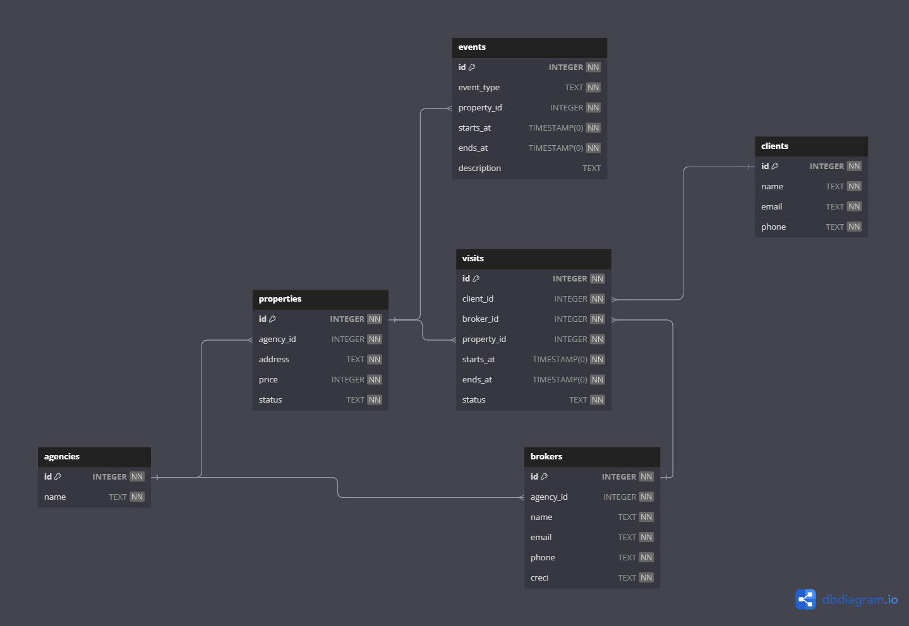

# Web Application Document

## ClickVisit 📅

#### Victor Grycajuk

## Sumário

1. [Introdução](#c1)  
2. [Visão Geral da Aplicação Web](#c2)  
3. [Projeto Técnico da Aplicação Web](#c3)  
4. [Desenvolvimento da Aplicação Web](#c4)  
5. [Referências](#c5)  

<br>

## <a name="c1"></a>1. Introdução (Semana 01)

### Descrição do Projeto

A ClickVisit é uma aplicação web para o agendamento de visitas a imóveis, destinada a corretores autônomos e, principalmente, a imobiliárias.

O sistema permite que os clientes visualizem a disponibilidade combinada entre duas agendas: a do corretor e a do imóvel. Com essas informações, o cliente consegue agendar, de forma simples e rápida, o melhor horário disponível para a sua própria agenda.

### Tipos de Login

- **Imobiliária (ou corretor autônomo):**  
  Responsável pelo cadastro de imóveis e pela gestão de suas respectivas agendas. Pode inserir bloqueios nos horários (como reformas, vistorias, entre outros) e definir quais corretores estão vinculados a cada imóvel.

- **Corretor de imobiliária:**  
  Gerencia sua agenda pessoal e os links exclusivos enviados a clientes interessados em determinados imóveis.

### Processo de Agendamento

O agendamento é totalmente feito pelo cliente, através de um link individual gerado pelo corretor.  
Ao acessá-lo, o cliente visualiza as agendas do imóvel e do corretor e escolhe o horário mais conveniente.

Uma vez confirmada, a reserva é automaticamente registrada tanto na agenda do imóvel quanto na do corretor, bloqueando aquele horário para futuras marcações.

### Objetivo

Proporcionar uma experiência de agendamento prática, visual e organizada para todas as partes envolvidas.


---

## <a name="c2"></a>2. Visão Geral da Aplicação Web

### 2.1. Personas (Semana 01)


### 2.2. User Stories (Semana 01)


#### US01: Como gerente da imobiliária, quero visualizar e controlar as agendas de todos os imóveis e corretores, para garantir que as visitas sejam organizadas sem conflitos de horários.

I - O gerente pode visualizar e controlar agendas sem depender de outras funcionalidades, como envio de links ou cadastro de novos clientes.

N - O nível de detalhe do controle (ex: apenas visualizar vs. editar horários) pode ser ajustado conforme a necessidade do projeto. 

V - Esse sistema traz valor direto para a organização e eficiência da imobiliária. Organiza agendas aumentando a produtividade dos corretores.

E - É possível estimar o esforço de desenvolvimento com base em requisitos simples (visualizar, bloquear horários, editar agendas).

S - É uma história que pode ser dividida e implementada de forma objetiva (não é como um épico). Engloba apenas alguns agendamentos e não todo o fluxo dos clientes (peospecção, mostragem de imóvel...).

T - É fácil criar testes para verificar se o gerente consegue visualizar todas as agendas e identificar conflitos de horários. Pode-se testar se o gerente consegue visualizar todas as agendas ou se, por exemplo, visitas em horários conflitantes não são possíveis de serem marcadas.

#### US02: Como corretor de imóveis, quero cadastrar minha agenda de disponibilidade, para facilitar o agendamento de visitas pelos clientes sem precisar gerenciar manualmente.

#### US03: Como cliente interessado em um imóvel, quero acessar um link e agendar uma visita em poucos cliques, para escolher o melhor horário disponível sem depender de intermediários.

---

## <a name="c3"></a>3. Projeto da Aplicação Web

### 3.1. Modelagem do banco de dados  (Semana 3)

#### Diagrama de modelos relacionais



#### SQL completo

Disponível em [`ClickVisit.sql`](../scripts/ClickVisit.sql), ou
<details>
  <summary>Clique para expandir</summary>

```sql
CREATE TABLE "agencies" (
  "id" INTEGER PRIMARY KEY NOT NULL,
  "name" TEXT NOT NULL
);

CREATE TABLE "brokers" (
  "id" INTEGER PRIMARY KEY NOT NULL,
  "agency_id" INTEGER NOT NULL,
  "name" TEXT NOT NULL,
  "email" TEXT NOT NULL,
  "phone" TEXT NOT NULL,
  "creci" TEXT NOT NULL
);

CREATE TABLE "properties" (
  "id" INTEGER PRIMARY KEY NOT NULL,
  "agency_id" INTEGER NOT NULL,
  "address" TEXT NOT NULL,
  "price" INTEGER NOT NULL,
  "status" TEXT NOT NULL
);

CREATE TABLE "events" (
  "id" INTEGER PRIMARY KEY NOT NULL,
  "event_type" TEXT NOT NULL,
  "property_id" INTEGER NOT NULL,
  "starts_at" TIMESTAMP(0) NOT NULL,
  "ends_at" TIMESTAMP(0) NOT NULL,
  "description" TEXT
);

CREATE TABLE "clients" (
  "id" INTEGER PRIMARY KEY NOT NULL,
  "name" TEXT NOT NULL,
  "email" TEXT NOT NULL,
  "phone" TEXT NOT NULL
);

CREATE TABLE "visits" (
  "id" INTEGER PRIMARY KEY NOT NULL,
  "client_id" INTEGER NOT NULL,
  "broker_id" INTEGER NOT NULL,
  "property_id" INTEGER NOT NULL,
  "starts_at" TIMESTAMP(0) NOT NULL,
  "ends_at" TIMESTAMP(0) NOT NULL,
  "status" TEXT NOT NULL
);

COMMENT ON COLUMN "events"."event_type" IS '"Available","maintenance"';

COMMENT ON COLUMN "visits"."status" IS '"confirmed", "canceled"';

ALTER TABLE "brokers" ADD CONSTRAINT "brokers_agency_id_foreign" FOREIGN KEY ("agency_id") REFERENCES "agencies" ("id");

ALTER TABLE "events" ADD CONSTRAINT "events_property_id_foreign" FOREIGN KEY ("property_id") REFERENCES "properties" ("id");

ALTER TABLE "visits" ADD CONSTRAINT "visits_property_id_foreign" FOREIGN KEY ("property_id") REFERENCES "properties" ("id");

ALTER TABLE "visits" ADD CONSTRAINT "visits_broker_id_foreign" FOREIGN KEY ("broker_id") REFERENCES "brokers" ("id");

ALTER TABLE "properties" ADD CONSTRAINT "properties_agency_id_foreign" FOREIGN KEY ("agency_id") REFERENCES "agencies" ("id");

ALTER TABLE "visits" ADD CONSTRAINT "visits_client_id_foreign" FOREIGN KEY ("client_id") REFERENCES "clients" ("id");


```
</details>

### 3.1.1 BD e Models (Semana 5)
#### Os models implementados até o momento, 24/05/2025 são:
#### agency.js - disponível em [`models/agency.js`](../models/agency.js)

    Realiza as manipulações no banco de dados referentes as agencias imobiliárias.
        create() - 'INSERT INTO agencies (name) VALUES ($1)'
        findAll() - 'SELECT * FROM agencies ORDER BY name ASC'
        update() - 'UPDATE agencies SET name = $1 WHERE id = $2'
        delete() - 'DELETE FROM agencies WHERE id = $1'

#### property.js - disponível em [`models/property.js`](../models/property.js)
    
    Realiza as manipulações no banco de dados referentes as propriedades de uma agencia imobiliaria especifica.
        create() - 'INSERT INTO properties (agency_id, address, price, status) VALUES ($1,$2,$3,$4)'
        findAll() - 'SELECT * FROM properties WHERE agency_id=$1 ORDER BY id'
        update() - 'UPDATE properties SET address=$1, price=$2, status=$3 WHERE id=$4'
        delete() - 'DELETE FROM properties WHERE id=$1'
### 3.2. Arquitetura (Semana 5)

#### O seguinte diagrama representa a arquitetura MVC do ClickVisit
<div align="center">
<sub align="center">Figura 3 - Diagrama de arquitetura MVC.  </sub>
</div>
<div align="center">

</div>
<div align="center">
<sup>Fonte: Victor Grycajuk usando Mermaid.io, 2025.</sup>
</div>

#### Até o momento, 24/05/2025, os conjuntos MVC implementados são: 
    AgencyView -> AgencyRoutes -> AgencyController -> AgencyModel
    PropertiesView -> PropertiesRoutes -> PropertiesController -> PropertiesModel 

#### Os conjuntos MVC restantes: Brokers, Clients, Events e Visits ainda estão sendo implementados.
### 3.3. Wireframes (Semana 03)

#### Consulta de imóveis para Imobiliária
Representa as funcionalidades descritas no User Story 01.
- US01: Como gerente da imobiliária, quero visualizar e controlar as agendas de todos os imóveis e corretores, para garantir que as visitas sejam organizadas sem conflitos de horários.

<div align="center">
<sub align="center">Figura 3 - Tela de consulta de imóveis para Imobiliária  </sub>
</div>
<div align="center">

</div>
<div align="center">
<sup>Fonte: Victor Grycajuk, 2025.</sup>
</div>

#### Seleção de horários para clientes.
Representa as funcionalidades descritas no User Story 03.
- US03: Como cliente interessado em um imóvel, quero acessar um link e agendar uma visita em poucos cliques, para escolher o melhor horário disponível sem depender de intermediários.

<div align="center">
<sub align="center">Figura 4 - Tela de seleção de horários para Cliente  </sub>
</div>
<div align="center">

</div>
<div align="center">
<sup>Fonte: Victor Grycajuk, 2025.</sup>
</div>


### 3.4. Guia de estilos (Semana 05)

*Descreva aqui orientações gerais para o leitor sobre como utilizar os componentes do guia de estilos de sua solução.*


### 3.5. Protótipo de alta fidelidade (Semana 05)

*Posicione aqui algumas imagens demonstrativas de seu protótipo de alta fidelidade e o link para acesso ao protótipo completo (mantenha o link sempre público para visualização).*

### 3.6. WebAPI e endpoints (Semana 05)

### Agências

| Método | Caminho                | Descrição                             | Controller                 |
| ------ | ---------------------- | ------------------------------------- | -------------------------- |
| GET    | `/agencies/`           | Lista todas as agências               | `agencyController.index`   |
| POST   | `/agencies/`           | Cria uma nova agência                 | `agencyController.store`   |
| POST   | `/agencies/edit/:id`   | Atualiza a agência indicada por `:id` | `agencyController.update`  |
| POST   | `/agencies/delete/:id` | Remove a agência indicada por `:id`   | `agencyController.destroy` |

---

### Imóveis (aninhados em `/agencies/:agencyId/properties`)

| Método | Caminho       | Descrição                                 | Controller                   |
| ------ | ------------- | ----------------------------------------- | ---------------------------- |
| GET    | `/`           | Lista os imóveis da agência (`:agencyId`) | `propertyController.index`   |
| POST   | `/`           | Cria um imóvel para a agência             | `propertyController.store`   |
| POST   | `/edit/:id`   | Atualiza o imóvel `:id` dessa agência     | `propertyController.update`  |
| POST   | `/delete/:id` | Remove o imóvel `:id` dessa agência       | `propertyController.destroy` |

---


### 3.7 Interface e Navegação (Semana 07)

*Descreva e ilustre aqui o desenvolvimento do frontend do sistema web, explicando brevemente o que foi entregue em termos de código e sistema. Utilize prints de tela para ilustrar.*

---

## <a name="c4"></a>4. Desenvolvimento da Aplicação Web (Semana 8)

### 4.1 Demonstração do Sistema Web (Semana 8)

*VIDEO: Insira o link do vídeo demonstrativo nesta seção*
*Descreva e ilustre aqui o desenvolvimento do sistema web completo, explicando brevemente o que foi entregue em termos de código e sistema. Utilize prints de tela para ilustrar.*

### 4.2 Conclusões e Trabalhos Futuros (Semana 8)

*Indique pontos fortes e pontos a melhorar de maneira geral.*
*Relacione também quaisquer outras ideias que você tenha para melhorias futuras.*


## <a name="c5"></a>5. Referências

_Incluir as principais referências de seu projeto, para que seu parceiro possa consultar caso ele se interessar em aprofundar. Um exemplo de referência de livro e de site:_<br>

---
---